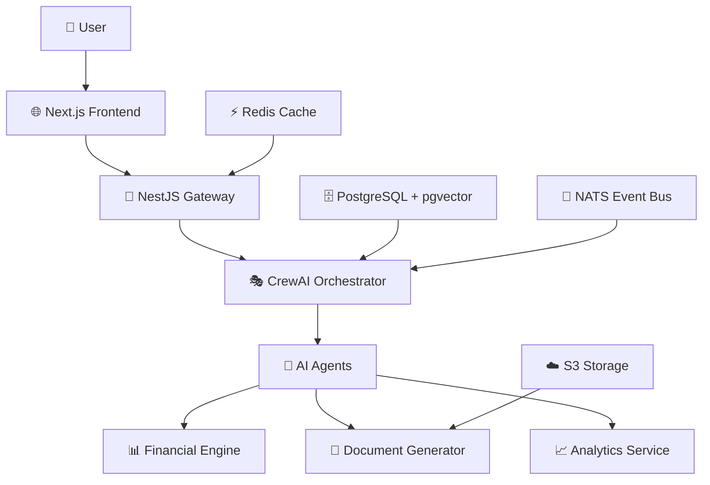

# 🚀 AI Startup Co-Founder Simulator
***with CrewAI***

> **Transform your startup ideas into actionable business plans with AI-powered co-founder debates**

## 🎯 What is the AI Startup Co-Founder Simulator?

The **AI Startup Co-Founder Simulator** is an innovative platform that brings together multiple AI agents to simulate realistic co-founder debates and decision-making processes for startup ideas. Think of it as having a complete founding team at your fingertips, ready to challenge, validate, and refine your business concepts.

### 🧠 How It Works

1. **📝 Idea Intake**: Submit your startup concept with structured prompts
2. **🤖 AI Co-Founder Debate**: Watch as 5 specialized AI personas debate your idea
3. **💡 Decision Making**: Participate in consensus-building for MVP scope and GTM strategy
4. **📊 Financial Modeling**: Get real-time CAC/LTV calculations and runway projections
5. **📈 Deliverables**: Generate pitch decks, financial models, and business blueprints
6. **📤 Export**: Seamlessly export to Google Slides, Excel, and other tools

## 🌟 Key Benefits

### 🎯 For Solo Founders
- **Instant Co-Founder Team**: Get diverse perspectives without finding human co-founders
- **Risk Mitigation**: Identify potential pitfalls before investing time and money
- **Validation**: Test multiple business model variations quickly
- **Professional Output**: Generate investor-ready materials

### 🏢 For Accelerators & Incubators
- **Structured Pre-Accelerator Tool**: Standardize idea evaluation processes
- **Scalable Mentorship**: Provide consistent guidance to multiple startups
- **Data-Driven Insights**: Track common patterns and success factors
- **Resource Optimization**: Focus human mentors on high-potential ideas

### 🎓 For Educational Institutions
- **Entrepreneurship Simulation**: Hands-on learning without real-world risks
- **MBA Program Integration**: Practical application of business theory
- **Case Study Generation**: Create realistic startup scenarios for analysis
- **Skill Development**: Build critical thinking and decision-making abilities

### 💼 For Startup Coaches & Mentors
- **Guided Ideation Sessions**: Structured approach to idea development
- **Client Preparation**: Help founders prepare for investor meetings
- **Market Research**: Quick validation of market assumptions
- **Strategic Planning**: Develop comprehensive go-to-market strategies

## 🤖 AI Agents Framework: Why CrewAI?

### 🏗️ CrewAI Framework Choice

We chose **CrewAI** as our core AI orchestration framework for several compelling reasons:

#### 🎭 **Multi-Agent Collaboration**
- **Natural Role-Based Agents**: Each AI persona has distinct expertise and communication style
- **Sequential Task Execution**: Agents build upon each other's insights in realistic debate flows
- **Dynamic Interaction**: Agents can challenge, agree, or build upon previous contributions

#### 🔧 **Advanced Tool Integration**
- **RAG (Retrieval-Augmented Generation)**: Agents access relevant market data and research
- **Financial Calculators**: Built-in tools for CAC/LTV, burn rate, and runway calculations
- **Market Analysis**: TAM/SAM/SOM estimation and competitive analysis tools
- **Risk Assessment**: Systematic identification and mitigation planning

#### 🎯 **Specialized Personas**
Our AI co-founder team consists of:

| Persona | 🎭 Role | 🎯 Expertise | 💬 Communication Style |
|---------|---------|--------------|----------------------|
| **🧠 Visionary** | Big Picture Thinker | Market opportunity, vision alignment | Inspirational, forward-thinking |
| **⚡ Tech Lead** | Technical Architect | Feasibility, implementation, scalability | Analytical, detail-oriented |
| **📈 Marketing** | Growth Strategist | Customer acquisition, GTM, branding | Data-driven, creative |
| **💰 Finance** | Financial Analyst | Unit economics, funding, runway | Conservative, metrics-focused |
| **⚠️ Skeptic** | Risk Assessor | Challenge assumptions, identify risks | Critical, contrarian |

#### 🚀 **Why CrewAI Over Alternatives?**

| Feature                       | CrewAI       | LangChain    | AutoGen     | Custom Solution |
|-------------------------------|--------------|--------------|-------------|-----------------|
| **Multi-Agent Orchestration** | ✅ Native    | ⚠️ Complex  | ✅ Good     | ❌ Build from scratch 
| **Role-Based Agents**         | ✅ Built-in  | ❌ Manual   | ✅ Good     | ❌ Manual 
| **Tool Integration**          | ✅ Seamless  | ✅ Good     | ✅ Good     | ❌ Complex 
| **Real-time Streaming**       | ✅ Supported | ⚠️ Limited  | ⚠️ Limited  | ❌ Manual 
| **Production Ready**          | ✅ Yes       | ⚠️ Evolving | ⚠️ Evolving | ❌ Risky 
| **Community & Support**       | ✅ Growing   | ✅ Large    | ✅ Growing  | ❌ None 

#### 🎪 **Real-World Simulation Capabilities**
- **Authentic Debates**: Agents maintain consistent personalities throughout sessions
- **Contextual Memory**: Remember previous discussions and build upon them
- **Decision Convergence**: Work toward consensus on critical business decisions
- **External Event Injection**: Respond to market changes and competitor actions

## 🏗️ Architecture Overview

---

### 🎮 First Simulation

1. **📝 Create a Startup**: Navigate to `/startups/new` and enter your idea
2. **📁 Upload Documents**: Add market research, competitor analysis, or business plans
3. **🎭 Start Simulation**: Click "Start Simulation" to begin the AI co-founder debate
4. **👀 Watch the Magic**: Observe as your AI team debates, challenges, and refines your idea
5. **📊 Review Results**: Analyze financial projections, risk assessments, and recommendations
6. **📤 Export Deliverables**: Generate pitch decks, financial models, and business blueprints

## 🎯 Use Cases & Applications

### 🏃‍♂️ **Solo Founder Validation**
- Test multiple business model variations
- Identify potential co-founder skill gaps
- Prepare for investor meetings
- Validate market assumptions

### 🏢 **Accelerator Programs**
- Standardize application evaluation
- Provide consistent feedback to applicants
- Identify high-potential startups early
- Generate comprehensive startup profiles

### 🎓 **Educational Programs**
- MBA entrepreneurship courses
- Startup bootcamp simulations
- Business plan competitions
- Case study development

### 💼 **Consulting & Coaching**
- Client ideation sessions
- Strategic planning workshops
- Market entry analysis
- Competitive positioning

## 📊 Key Features

### 🎭 **AI Co-Founder Simulation**
- 5 specialized AI personas with unique expertise
- Real-time debate streaming with WebSocket
- Contextual memory and decision convergence
- External event injection for market changes

### 📈 **Financial Modeling**
- Real-time CAC/LTV calculations
- Burn rate and runway projections
- Sensitivity analysis with interactive sliders
- Multiple funding scenario modeling

### 📄 **Professional Deliverables**
- Auto-generated pitch decks
- Comprehensive financial models
- Business blueprints and risk maps
- Hiring roadmaps and operational plans

### 🔒 **Enterprise Security**
- Role-based access control (RBAC)
- Multi-tenant architecture
- Audit logging and compliance
- Rate limiting and API protection

## 🛠️ Technology Stack

### Frontend
- **⚛️ Next.js 14** - React framework with App Router
- **🎨 Tailwind CSS** - Utility-first styling
- **🧩 shadcn/ui** - Component library
- **📊 Recharts** - Data visualization
- **🔄 Zustand** - State management

### Backend
- **🎭 CrewAI** - Multi-agent orchestration
- **⚡ FastAPI** - Python web framework
- **🚪 NestJS** - Node.js API gateway
- **🗄️ PostgreSQL** - Primary database
- **📊 pgvector** - Vector embeddings
- **⚡ Redis** - Caching and sessions

### Infrastructure
- **🐳 Docker** - Containerization
- **☁️ AWS S3** - Object storage
- **📡 NATS** - Event messaging
- **📊 Prometheus** - Metrics collection
- **🔍 Grafana** - Monitoring dashboards

Made with ❤️ by Derril FIlemon

